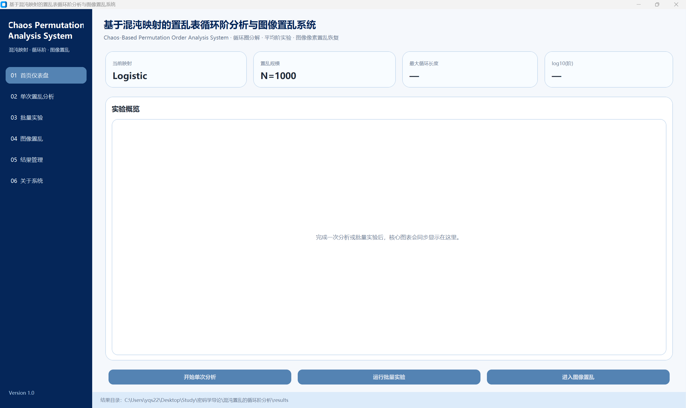
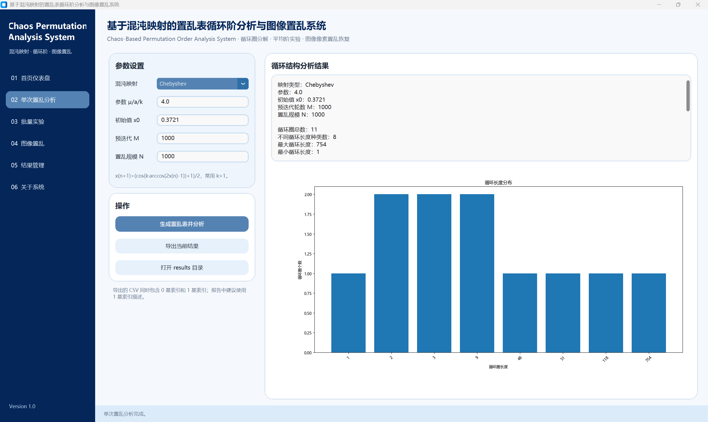
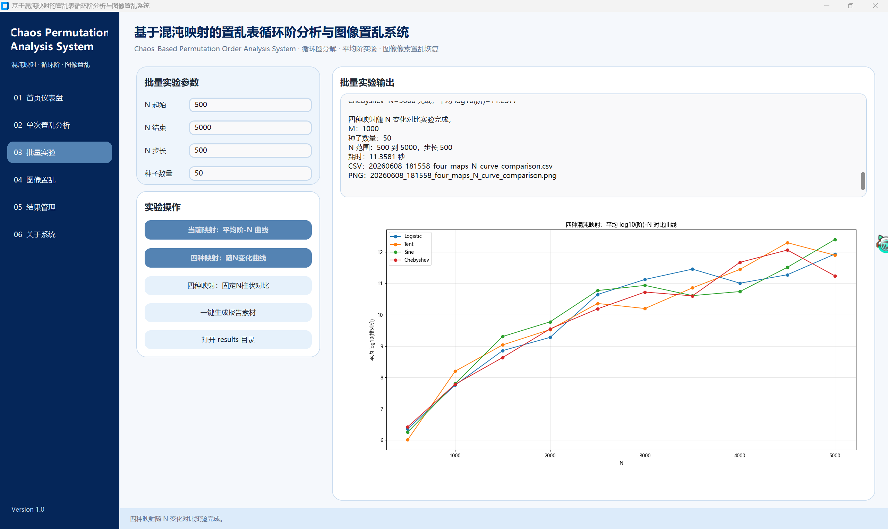
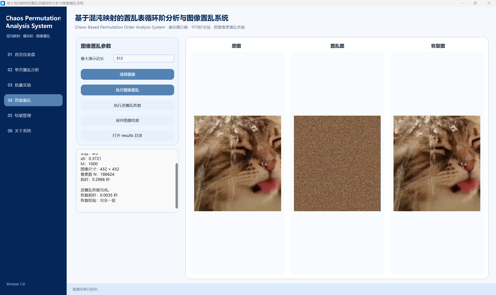
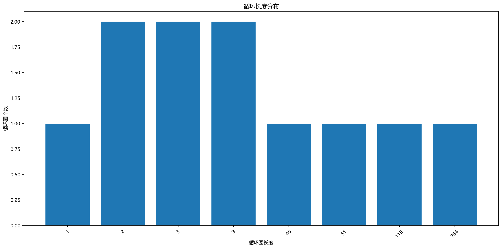
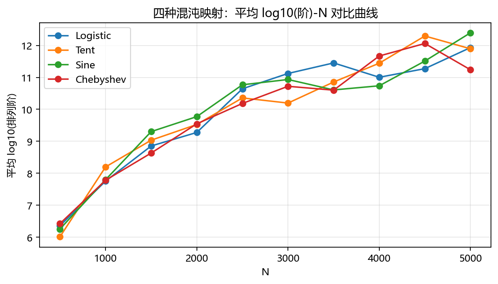
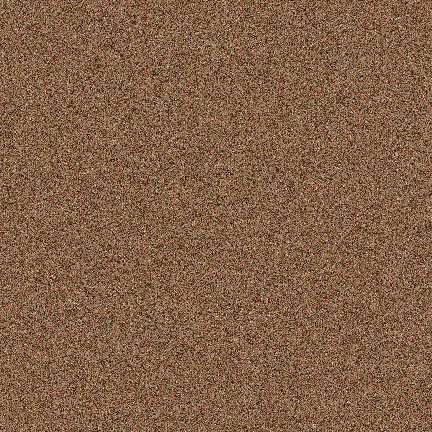

# Chaos Permutation Analysis System

## 基于混沌映射的置乱表循环阶分析与图像置乱系统

一个基于 Python + CustomTkinter 开发的桌面 GUI 软件，用于生成混沌置乱表、分析排列循环阶、比较不同混沌映射的置乱性能，并提供图像置乱与逆置乱恢复演示功能。

## 功能特点

* 支持 Logistic、Tent、Sine、Chebyshev 四种混沌映射
* 支持置乱表生成与循环圈分解
* 统计循环圈数量、最大循环长度、不动点数量、排列阶与 log10(阶)
* 支持平均阶随置乱规模 N 变化的批量实验
* 支持四种混沌映射的横向对比实验
* 支持图像置乱与逆置乱恢复
* 支持 CSV、PNG、TXT 等实验结果导出
* 提供简约蓝灰风格桌面 GUI

## 软件界面

### 首页仪表盘



### 单次置乱分析



### 四种映射随 N 变化对比



### 图像置乱与恢复演示



## 实验结果示例

### 循环长度分布



### 四种映射平均阶对比曲线



### 图像置乱结果

| 原图                                                | 置乱图                                                 | 恢复图                                                 |
| ------------------------------------------------- | --------------------------------------------------- | --------------------------------------------------- |
|  |  |  |

## 运行环境

建议使用 Python 3.11。

主要依赖：

* customtkinter
* matplotlib
* pillow
* pandas
* numpy

## 安装与运行

克隆项目后进入项目目录：

```bash
git clone https://github.com/Ayunia-23/chaos-permutation-analysis.git
cd chaos-permutation-analysis
```

创建并激活 Conda 环境：

```bash
conda create -n chaos_perm python=3.11 -y
conda activate chaos_perm
```

安装依赖：

```bash
pip install -r requirements.txt
```

运行程序：

```bash
python main_v3.5.py
```

## 推荐实验参数

单次置乱分析：

```text
映射类型：Chebyshev
参数：4
初始值 x0：0.3721
预迭代 M：1000
置乱规模 N：1000
```

四映射随 N 变化实验：

```text
N起始：500
N结束：5000
N步长：500
种子数量：50
```

## 项目结构

```text
chaos-permutation-analysis/
├── assets/
│   └── screenshots/
│       ├── 01_dashboard.png
│       ├── 02_single_analysis.png
│       ├── 03_four_maps_curve.png
│       └── 04_image_scramble_demo.png
├── results_demo/
│   ├── demo_cycle_distribution.png
│   ├── demo_four_maps_N_curve.png
│   ├── demo_image_original.png
│   ├── demo_image_scrambled.png
│   ├── demo_image_recovered.png
│   └── demo_summary.txt
├── main_v3.5.py
├── requirements.txt
├── README.md
└── .gitignore
```

## 实验结论概述

实验结果表明，随着置乱规模 N 的增大，四种混沌映射生成置乱表的平均 log10(阶) 整体呈上升趋势，说明较大规模下置乱表通常具有更复杂的循环结构和更长的周期特性。

在不同 N 取值下，Logistic、Tent、Sine、Chebyshev 四种映射的表现存在差异，未出现某一种映射在全部规模下始终占优的情况，说明混沌映射类型、控制参数和初始值都会影响置乱表的循环结构。

图像置乱实验中，系统能够有效打乱图像的空间结构，并通过逆置乱恢复原图，验证了置乱表生成与逆变换过程的正确性。

## 应用场景

本项目可用于：

* 密码学课程实验与教学演示
* 混沌映射置乱性能分析
* 图像置乱加密预处理演示
* 排列循环结构与阶分析实验
* 混沌密码算法原型验证

## License

License will be added later.
